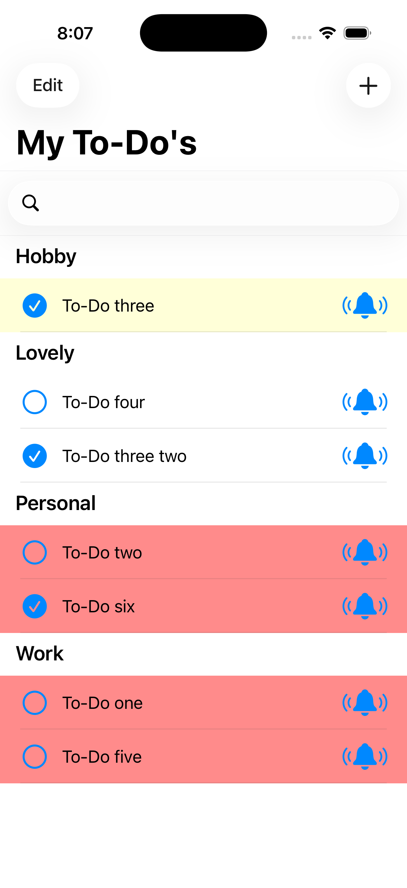
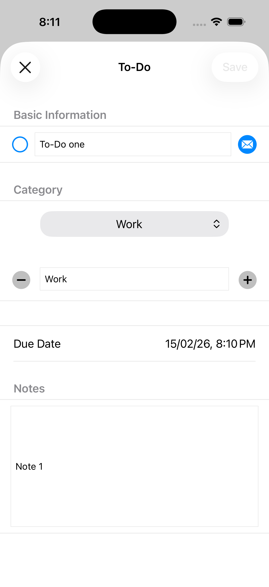
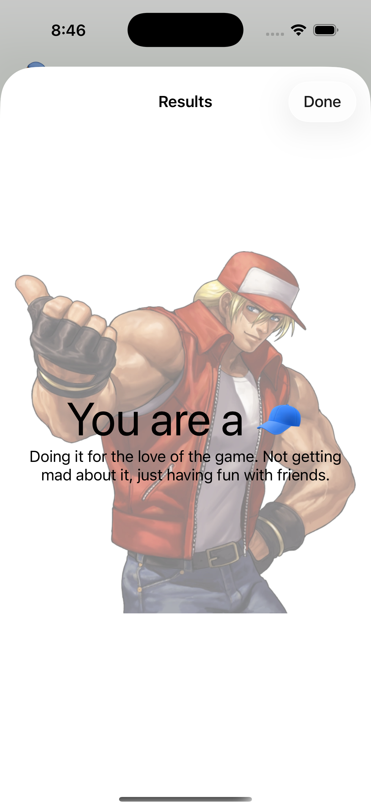
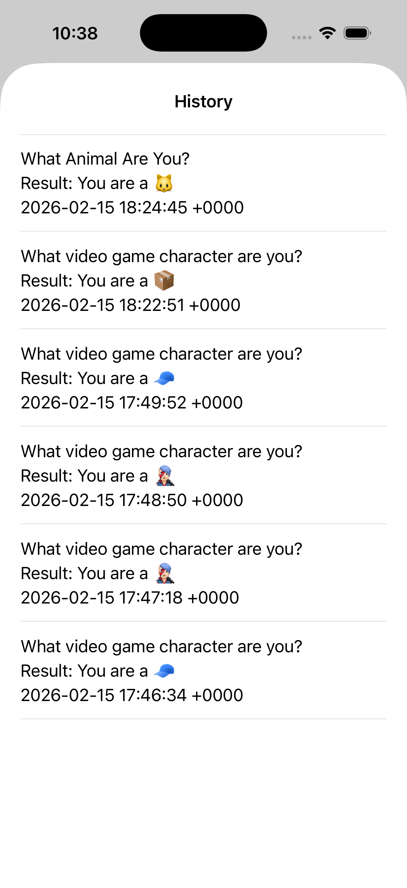

# Mobile programming re-assessment

## projects instructions
[To-Do List instructions](#to-do-list) 
[Addressing the mail function issue](#the-mail-function-in-the-to-do-app) 
[Personality-Quiz instructions](#personality-quiz) 

## Figma prototype link
https://www.figma.com/design/xLicMT2zCXB8xnnd7vtCIm/Untitled?node-id=0-1&t=eRZ4OZzFPe46YO4S-1

## Feature List
<ol>
  <li>Personality Quiz
  <ol>
      <li>Multiple personality quizzes</li>
      <li>Randomized questions</li>
      <li>Support for dynamic Answer count</li>
      <li>Quiz history screen</li>
      <li>Quiz timer</li>
    </ol>
  </li>
</ol>

<ol>
  <li>To-Do List
  <ol>
      <li>Share feature using the mail app (See below)</li>
      <li>Search Field to search tasks</li>
      <li>the ability to categories tasks</li>
      <li>the ability to assign due dates</li>
      <li>Reminder feature for user-selected tasks</li>
    </ol>
  </li>
</ol>

### To-Do List
The application starts with a To-Do list of items the user created. If this is the first time the user opens the app, the app creates six To-Dos spread across different categories, and shows the tasks that are remaining to be done. Some of these are colored a light yellow indicating the task has less than 24 hours remaining until the deadline, and some of these tasks are colored red indicating an overdue of the task. There is a search bar which enables the user to search for their tasks.

  

When the user taps one of these starting tasks, they will be greeted to an edit screen where they can edit the task information such as the task name, its completion status, its category, the due date of this task, a mail button which will segue them to the mail app (more on that later), and finally the notes.

  

In the category section of the edit screen there is a plus and a minus signs indicating addition and deletion of these categories. If the add button is tapped the text-box and the button gets reset so the user can add their own custom category. Also the category names can be edited by selecting the category itself then changing the text in the text-box to the new name. If the user decides to add a task they can do that by tapping the plus button in the Home Screen, which will get them to a similar screen to the edit screen. Then the user will have to fill the required information about their task and tap save. The app gives the user the ability to edit (remove) any tasks by either swiping the task itself or tapping the edit button to remove the task.

  

You might have noticed the bell icon wondering what does it do? The bell icon segues you to a style sheet view asking you to choose a time to get reminded on and the app will tell you what you chose in a popup alert.

  

#### The mail function in the To-Do app
Unfortunately, the mail app does not work on the simulator because of the lack of credentials. So, to use this feature you should have an actual iPhone with real credentials saved on the mail app, otherwise the function will not work.

### Personality Quiz
The application starts with a greeting to the user and asks them to choose between multiple quizzes.

  

If the user chose one of the quizzes the app segues into an introduction screen about the quiz they chose. When the user begins the quiz they get asked questions and they choose based on their personality. At the end, the personality points gets calculated and a result screen appears saying to the user what personality they represent and a description about this personality.

  

After completing the quiz and returning to the introduction screen the user can start over the quiz or return back to the quiz selection screen. In this screen there is a quiz history button at the bottom. This will show the user all the quizzes they’ve taken with the results of the quiz and the date the quiz taken.

  

